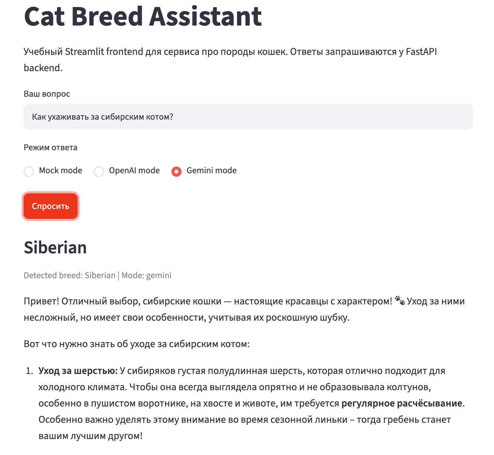
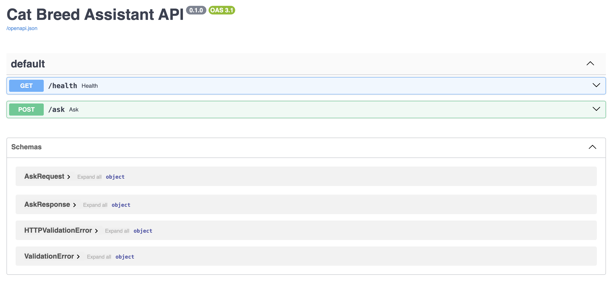

# Cat Breed Assistant

An educational portfolio project that turns LLM-style answer logic into a small working service with a Streamlit UI, FastAPI backend, local breed knowledge base, mock mode, optional LLM providers and Docker Compose packaging.

Небольшой учебный сервис про породы кошек: пользователь задаёт текстовый вопрос, приложение определяет породу по локальной базе знаний и возвращает дружелюбный ответ через mock-логику или внешний LLM API.

## Demo

### Streamlit frontend



### FastAPI backend docs



## What This Project Demonstrates

- A frontend/backend split for a small AI-style application.
- HTTP communication between Streamlit and FastAPI.
- A simple local data layer before answer generation.
- Multiple provider modes behind one backend service layer.
- Safe API-key handling with `.env` and `.env.example`.
- Docker Compose packaging with separate frontend and backend services.
- Graceful handling of missing API keys, unknown breeds and backend errors.

## Architecture

```text
Streamlit frontend → FastAPI backend → breed retriever → LLM/mock provider
```

The Streamlit app does not call mock, OpenAI, Gemini or Mistral logic directly. It sends user questions to the FastAPI backend. The backend builds breed context from local JSON and routes the request to the selected answer provider.

## Current RAG Architecture

```text
User text query
→ FastAPI backend
→ CatAPI hybrid retriever
→ retrieved CatAPI context
→ LLM provider: Mock / Mistral / Gemini / OpenAI
→ Streamlit answer + retrieval logs
```

The current retriever is not pure vector search. It is a controlled hybrid retrieval baseline:

1. Breed alias detection.
2. Structured CatAPI retrieval.
3. No-match guard.
4. LLM grounded answer.

This means explicit breed questions are matched by Russian and English aliases first. If no breed is named, the backend scores structured CatAPI fields such as weight, temperament, grooming level, vocalisation, intelligence, hairless flag and hypoallergenic flag. If nothing relevant is found, the backend returns `no_match` instead of inventing a random breed.

## Features

- Ask text questions about cat breeds in a Streamlit UI.
- Use `Mock mode` without any API keys.
- Use `Gemini mode` with `GEMINI_API_KEY`.
- Use `Mistral mode` with `MISTRAL_API_KEY`.
- Keep `OpenAI mode` available in the backend API with `OPENAI_API_KEY`.
- Retrieve breed facts from a local JSON knowledge base.
- Retrieve CatAPI breed context from processed local chunks.
- Detect known breeds by English and Russian aliases.
- Return `no_match` when no relevant CatAPI context is found.
- Keep retrieval diagnostics in logs instead of cluttering the Streamlit page.
- Run locally with two processes or with one Docker Compose command.

## Tech Stack

- Python 3.12
- Streamlit
- FastAPI
- Uvicorn
- Requests
- Pydantic
- OpenAI Python SDK
- Google Gen AI SDK (`google-genai`)
- Mistral AI SDK (`mistralai`)
- python-dotenv
- Sentence Transformers and ChromaDB kept for the next local retrieval layer
- Docker / Docker Compose

## Project Structure

```text
cat-breed-assistant/
├── assets/
│   ├── fastapi_docs.png
│   └── streamlit_demo.png
├── backend/
│   ├── __init__.py
│   ├── main.py
│   ├── schemas.py
│   └── services.py
├── data/
│   ├── breed_profiles.json
│   ├── processed/
│   │   ├── catapi_breed_documents.jsonl
│   │   └── catapi_chunks.jsonl
│   └── raw/              # ignored by Git
├── docs/
│   └── catapi_rag_stage_report.md
├── scripts/
│   ├── build_catapi_chunks.py
│   ├── build_catapi_documents.py
│   ├── build_catapi_rag_index.py
│   └── fetch_catapi_breeds.py
├── src/
│   ├── __init__.py
│   ├── breed_retriever.py
│   ├── cat_knowledge.py
│   ├── gemini_client.py
│   ├── llm_client.py
│   ├── mistral_client.py
│   └── rag/
│       ├── __init__.py
│       └── catapi_retriever.py
├── tests/
│   └── check_catapi_retriever.py
├── .dockerignore
├── .env.example
├── .gitignore
├── Dockerfile
├── PROJECT_SUMMARY.md
├── README.md
├── app.py
├── docker-compose.yml
├── requirements-app.txt
└── requirements.txt
```

## Run Locally

Create and activate a virtual environment:

```bash
python3.12 -m venv .venv
source .venv/bin/activate
```

Install dependencies:

```bash
pip install -r requirements.txt
```

Start the backend in terminal 1:

```bash
uvicorn backend.main:app --reload --port 8000
```

Start the frontend in terminal 2:

```bash
streamlit run app.py
```

Open the Streamlit URL printed in the terminal, usually:

```text
http://localhost:8501
```

Backend healthcheck:

```bash
curl http://localhost:8000/health
```

Mock ask endpoint:

```bash
curl -X POST http://localhost:8000/ask \
  -H "Content-Type: application/json" \
  -d '{"question":"Расскажи про мейн-куна","mode":"mock"}'
```

Mock ask endpoint with CatAPI baseline retrieval enabled:

```bash
curl -X POST http://localhost:8000/ask \
  -H "Content-Type: application/json" \
  -d '{"question":"Расскажи про сибирскую кошку","mode":"mock","use_rag":true}'
```

`use_rag=true` uses the local processed CatAPI chunks and returns `retrieved_context`, `retrieval_strategy`, and `detected_breed`.

Run local regression checks:

```bash
python -m compileall app.py src backend scripts
python tests/check_catapi_retriever.py
```

## Run With Docker

Build and start both services:

```bash
docker compose up --build
```

The Docker image uses `requirements-app.txt`, a lightweight runtime dependency
set for the Streamlit/FastAPI service. The heavier notebook/indexing
dependencies stay in `requirements.txt` for local experiments.

The Streamlit frontend will be available at:

```text
http://localhost:8501
```

FastAPI docs will be available at:

```text
http://localhost:8000/docs
```

Inside the Docker Compose network, the frontend calls the backend by service name:

```text
http://backend:8000
```

That value is passed to the frontend as:

```bash
BACKEND_URL=http://backend:8000
```

Stop the services:

```bash
docker compose down
```

## Environment Variables

Create a local `.env` file from the example:

```bash
cp .env.example .env
```

Add real keys only if you want to use LLM modes:

```bash
OPENAI_API_KEY=your_openai_api_key_here
GEMINI_API_KEY=your_gemini_api_key_here
MISTRAL_API_KEY=your_mistral_api_key_here
CAT_API_KEY=your_catapi_key_here
BACKEND_URL=http://localhost:8000
```

`Mock mode` works without `.env`.

Do not commit `.env`. The repository includes only `.env.example`, which contains placeholders. `.env` is ignored by Git and excluded from the Docker build context.

## Mock Mode Vs LLM Modes

`Mock mode` builds a deterministic answer from local breed facts. It is useful for demos, tests and development without paid API access.

`OpenAI mode` sends the question and breed context to OpenAI through `src/llm_client.py`.

`Gemini mode` sends the question and breed context to Gemini through `src/gemini_client.py`.

`Mistral mode` sends the question and breed context to Mistral through `src/mistral_client.py`.

LLM prompts instruct the model to answer in Russian, use only the provided context and avoid invented medical advice. If the local data is not enough, the model should say so.

## Data Layer / RAG-lite

The project uses a small local knowledge base:

```text
data/breed_profiles.json
```

Each profile contains aliases, origin, appearance, temperament, care notes, cautious health notes, fun facts and differences from other breeds.

This layer is intentionally simple:

1. FastAPI receives the user question.
2. `src/breed_retriever.py` searches breed names and aliases in local JSON.
3. The backend builds `breed_context`.
4. Mock/OpenAI/Gemini/Mistral modes use the same context.

If no breed is detected, the backend returns `Unknown breed` and shows which breeds are currently available.

## CatAPI Data Source

The project uses TheCatAPI as the first controlled external data source for breed information.

Source:

```text
https://api.thecatapi.com/v1/breeds
```

Current processed data:

- `data/processed/catapi_breed_documents.jsonl`
- `data/processed/catapi_chunks.jsonl`
- 67 breeds
- 67 documents
- 67 chunks
- one chunk = one breed profile

Fetch raw breed data:

```bash
python scripts/fetch_catapi_breeds.py
```

Build readable breed documents:

```bash
python scripts/build_catapi_documents.py
```

Build simple one-profile-per-breed chunks:

```bash
python scripts/build_catapi_chunks.py
```

Optionally build a local ChromaDB index for notebook inspection:

```bash
python scripts/build_catapi_rag_index.py
```

`CAT_API_KEY` is optional. If it is present in `.env`, the fetch script sends it through the `x-api-key` header. If it is missing, the script tries an unauthenticated request.

Generated raw data is stored in:

```text
data/raw/catapi_breeds.json
```

`data/raw/` is ignored by Git because it contains downloaded source data. The processed files can be committed if they stay small enough for the repository:

```text
data/processed/catapi_breed_documents.jsonl
data/processed/catapi_chunks.jsonl
```

## CatAPI Data Layer

The CatAPI data layer is now connected to the backend. When Streamlit sends a question, the backend retrieves CatAPI context before calling the selected provider.

Current flow:

```text
question → retrieve_catapi_context() → retrieved_context → provider prompt
```

The LLM providers receive CatAPI context and are instructed to use it as the primary source of facts. `Mock mode` also uses retrieved CatAPI context, so retrieval can be tested without API keys.

If CatAPI has a real `image_url`, the UI can show it. If only `reference_image_id` exists, the id is returned in backend metadata and logged by the frontend.

## Retrieval Behavior

Examples from the current retriever:

| Question | Strategy | Expected retrieved context |
| -------- | -------- | -------------------------- |
| `Чем британские котики отличаются от обычных?` | `alias_exact_breed` | British Shorthair |
| `Как ухаживать за сфинксом?` | `alias_exact_breed` | Sphynx |
| `Какая кошка большая, спокойная и ласковая?` | `structured_fields` | British Shorthair / Ragamuffin / Ragdoll |
| `Какая кошка разговорчивая и умная?` | `structured_fields` | Balinese / Bengal / Bombay / Burmese-like candidates |
| `long hair grooming` | `structured_fields` | British Longhair / Chantilly-Tiffany / Himalayan |
| `Какая кошка умеет чинить ноутбук?` | `no_match` | No random breed returned |

## Why Not Embeddings Yet?

Embeddings were tested in notebooks and the embedding model technically worked. However, semantic retrieval quality on the current CatAPI corpus was unstable for the target Russian-language breed questions.

Structured CatAPI fields gave more controlled and inspectable results than pure dense retrieval on short breed profiles. Because of that, the current app uses hybrid CatAPI retrieval first.

Vector retrieval may be added later as an optional layer after a model bake-off. ChromaDB and Sentence Transformers are kept for experiments, but they are not the primary backend retrieval path right now.

## Baseline RAG Notebook Results

`notebooks/baseline_rag.ipynb` was used to inspect the prepared CatAPI data and test a lightweight baseline retrieval strategy before wiring a full vector index into the app.

Observed results from the notebook run:

- The repository cloned successfully in Kaggle.
- Prepared CatAPI files were found and loaded.
- Loaded corpus size:

```text
Documents: 67
Chunks: 67
Unique breeds in documents: 67
Unique breeds in chunks: 67
```

- Breed inspection worked for British Shorthair, Maine Coon, Siamese, Persian and Sphynx.
- Hybrid baseline retrieval produced useful matches:
  - `Чем британские котики отличаются от обычных?` → British Shorthair
  - `Как ухаживать за сфинксом?` → Sphynx
  - `hairless cat care` → Donskoy, Sphynx, Bambino
  - `long hair grooming` → British Longhair, Chantilly-Tiffany, Himalayan
- Structured retrieval by CatAPI fields was more useful for Russian breed questions than plain semantic search in that Kaggle run.
- The optional `sentence-transformers` semantic section did not run successfully in that environment because of a Kaggle dependency/import issue around `AutoModelForSequenceClassification`.

Conclusion: the baseline notebook validates the processed CatAPI corpus and shows that alias detection plus structured CatAPI fields are useful for Russian-language questions. It is a baseline retrieval notebook, not the final ChromaDB vector RAG integration.

## Example Questions

```text
Чем британские котики отличаются от обычных?
Расскажи про мейн-куна
Как ухаживать за сфинксом?
Сравни сиамскую кошку и перса
Какая порода подойдёт спокойному человеку?
Чем бенгальская кошка отличается от оцелота?
```

## Sample Output

```text
Maine Coon — не просто красивое название, а целый набор породных особенностей.

Внешний вид: крупное тело, длинный пушистый хвост и мощный костяк.
Характер: обычно дружелюбные, общительные и любопытные.
Уход: регулярное расчёсывание, пространство для движения и устойчивые когтеточки.
```

## What I Learned

- How to split a small app into frontend and backend.
- How to call a FastAPI backend from Streamlit.
- How to add a local data layer before LLM providers.
- How to pass structured breed context into mock and LLM providers.
- How to keep mock and LLM provider logic behind a service layer.
- How to load API keys from environment variables.
- How to handle missing credentials and unknown retrieval results gracefully.
- How to package a two-service app with Docker Compose.

## Next Steps

- Add focused unit tests for breed retrieval and backend response contracts.
- Add a cleaner local retrieval source for richer breed facts.
- Add more breed profiles and richer aliases.
- Add a lightweight comparison response for multi-breed questions.
- Improve frontend styling without changing the core architecture.

## Notes

This is intentionally a small learning MVP. It includes a local RAG-lite layer, but does not include authentication, a database, background workers or a production deployment pipeline.
