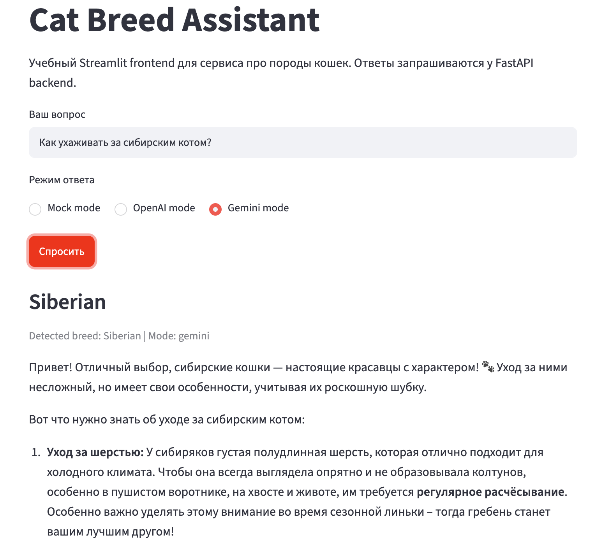
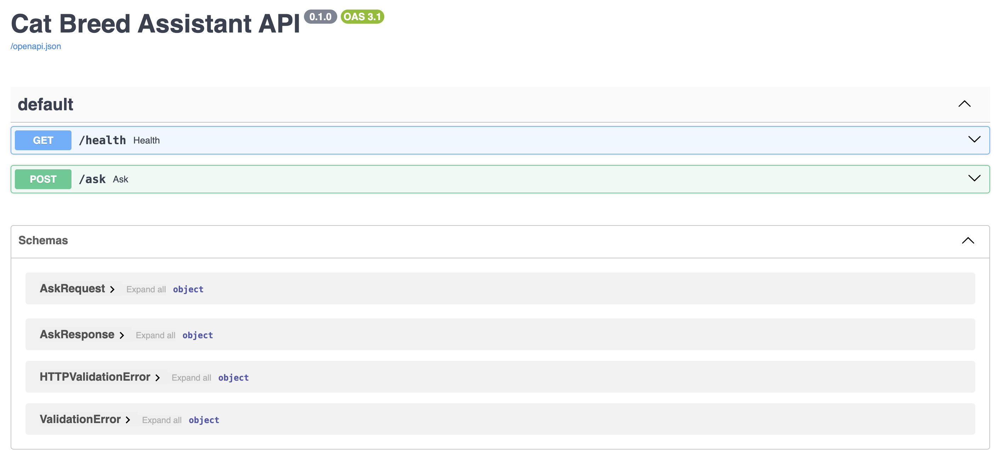

# Cat Breed Assistant

An educational portfolio project that turns LLM-style answer logic into a small working service with a Streamlit UI, FastAPI backend, local breed knowledge base, mock mode, optional LLM providers and Docker Compose packaging.

Небольшой учебный сервис про породы кошек: пользователь задаёт текстовый вопрос, приложение определяет породу по локальной базе знаний и возвращает дружелюбный ответ через mock-логику или внешний LLM API.

## Demo

### Streamlit frontend



### FastAPI backend docs



## What This Project Demonstrates

- A frontend/backend split for a small AI-style application.
- HTTP communication between Streamlit and FastAPI.
- A reproducible local knowledge pipeline before answer generation.
- Multiple provider modes behind one backend service layer.
- Source provenance, curated overrides and corpus integrity checks for retrieval data.
- Safe API-key handling with `.env` and `.env.example`.
- Docker Compose packaging with separate frontend and backend services.
- Graceful handling of missing API keys, unknown breeds and backend errors.

## Architecture

```text
Streamlit frontend → FastAPI backend → breed retriever → LLM/mock provider
```

The Streamlit app does not call mock, OpenAI, Gemini or Mistral logic directly. It sends user questions to the FastAPI backend. The backend builds breed context from local retrieval data and routes the request to the selected answer provider.

## Current RAG Architecture

```text
User text query
→ FastAPI backend
→ CatAPI hybrid retriever
→ retrieved local breed context
→ LLM provider: Mock / Mistral / Gemini / OpenAI
→ Streamlit answer + retrieval logs
```

The current retriever is not pure vector search. It is a controlled hybrid retrieval baseline:

1. Breed alias detection.
2. Structured CatAPI retrieval.
3. No-match guard.
4. LLM grounded answer.

This means explicit breed questions are matched by Russian and English aliases first. If no breed is named, the backend scores structured CatAPI fields such as weight, temperament, grooming level, vocalisation, intelligence, hairless flag and hypoallergenic flag. If nothing relevant is found, the backend returns `no_match` instead of inventing a random breed.

The current application still uses this controlled baseline retriever at runtime. In parallel, the repository now contains a prepared retrieval corpus that will be used for the next RAG stages:

```text
TheCatAPI registry
→ Wikidata entity resolution
→ Wikipedia source resolution
→ cleaned Wikipedia articles
→ knowledge documents
→ deterministic retrieval chunks
```

This corpus preparation step is intentionally separate from the live app path. It makes the source data inspectable before adding BM25, dense retrieval, reranking or grounded answer generation.

## Features

- Ask text questions about cat breeds in a Streamlit UI.
- Use `Mock mode` without any API keys.
- Use `Gemini mode` with `GEMINI_API_KEY`.
- Use `Mistral mode` with `MISTRAL_API_KEY`.
- Keep `OpenAI mode` available in the backend API with `OPENAI_API_KEY`.
- Retrieve breed facts from a local JSON knowledge base.
- Retrieve CatAPI breed context from processed local chunks.
- Build a deterministic knowledge corpus from CatAPI, Wikidata and Wikipedia sources.
- Detect known breeds by English and Russian aliases.
- Return `no_match` when no relevant CatAPI context is found.
- Keep retrieval diagnostics in logs instead of cluttering the Streamlit page.
- Run locally with two processes or with one Docker Compose command.

## Tech Stack

- Python 3.12
- Streamlit
- FastAPI
- Uvicorn
- Requests
- Pydantic
- OpenAI Python SDK
- Google Gen AI SDK (`google-genai`)
- Mistral AI SDK (`mistralai`)
- python-dotenv
- Sentence Transformers and ChromaDB kept for the next local retrieval layer
- Docker / Docker Compose
- Pytest

## Project Structure

```text
cat-breed-assistant/
├── assets/
│   ├── fastapi_docs.png
│   └── streamlit_demo.png
├── backend/
│   ├── __init__.py
│   ├── main.py
│   ├── schemas.py
│   └── services.py
├── data/
│   ├── breed_profiles.json
│   ├── curated/
│   │   ├── breed_name_overrides.json
│   │   ├── breed_registry.jsonl
│   │   ├── broader_source_chunk_overrides.json
│   │   ├── wikidata_overrides.json
│   │   ├── wikipedia_review_overrides.json
│   │   └── wikipedia_source_overrides.json
│   ├── processed/
│   │   ├── catapi_breed_documents.jsonl
│   │   ├── catapi_chunks.jsonl
│   │   ├── knowledge_documents.jsonl
│   │   └── knowledge_chunks.jsonl
│   ├── raw/              # downloaded source snapshots
│   ├── reports/          # unresolved cases, statistics and integrity reports
│   ├── staging/          # normalized ingestion results
│   └── cache/            # local HTTP/API cache for reproducible rebuilds
├── docs/
│   └── catapi_rag_stage_report.md
├── scripts/
│   ├── build_breed_registry.py
│   ├── build_catapi_chunks.py
│   ├── build_catapi_documents.py
│   ├── build_catapi_rag_index.py
│   ├── build_knowledge_chunks.py
│   ├── build_knowledge_documents.py
│   ├── build_wikidata_enrichment.py
│   ├── build_wikipedia_articles.py
│   └── fetch_catapi_breeds.py
├── src/
│   ├── __init__.py
│   ├── breed_retriever.py
│   ├── cat_knowledge.py
│   ├── gemini_client.py
│   ├── llm_client.py
│   ├── mistral_client.py
│   ├── data/
│   │   ├── chunking.py
│   │   ├── knowledge_documents.py
│   │   ├── wikidata_client.py
│   │   ├── wikidata_resolver.py
│   │   ├── wikipedia_client.py
│   │   └── wikipedia_parser.py
│   └── rag/
│       ├── __init__.py
│       └── catapi_retriever.py
├── tests/
│   ├── check_catapi_retriever.py
│   ├── test_build_breed_registry.py
│   ├── test_build_knowledge_chunks.py
│   ├── test_build_knowledge_documents.py
│   ├── test_build_wikipedia_articles.py
│   ├── test_wikidata_enrichment.py
│   ├── test_wikipedia_client.py
│   └── test_wikipedia_parser.py
├── .dockerignore
├── .env.example
├── .gitignore
├── Dockerfile
├── PROJECT_SUMMARY.md
├── README.md
├── app.py
├── docker-compose.yml
├── requirements-app.txt
└── requirements.txt
```

## Run Locally

Create and activate a virtual environment:

```bash
python3.12 -m venv .venv
source .venv/bin/activate
```

Install dependencies:

```bash
pip install -r requirements.txt
```

Start the backend in terminal 1:

```bash
uvicorn backend.main:app --reload --port 8000
```

Start the frontend in terminal 2:

```bash
streamlit run app.py
```

Open the Streamlit URL printed in the terminal, usually:

```text
http://localhost:8501
```

Backend healthcheck:

```bash
curl http://localhost:8000/health
```

Mock ask endpoint:

```bash
curl -X POST http://localhost:8000/ask \
  -H "Content-Type: application/json" \
  -d '{"question":"Расскажи про мейн-куна","mode":"mock"}'
```

Mock ask endpoint with CatAPI baseline retrieval enabled:

```bash
curl -X POST http://localhost:8000/ask \
  -H "Content-Type: application/json" \
  -d '{"question":"Расскажи про сибирскую кошку","mode":"mock","use_rag":true}'
```

`use_rag=true` uses the local processed CatAPI chunks and returns `retrieved_context`, `retrieval_strategy`, and `detected_breed`.

Run local regression checks:

```bash
python -m compileall app.py src backend scripts
python tests/check_catapi_retriever.py
pytest -q
```

## Run With Docker

Build and start both services:

```bash
docker compose up --build
```

The Docker image uses `requirements-app.txt`, a lightweight runtime dependency
set for the Streamlit/FastAPI service. The heavier notebook/indexing
dependencies stay in `requirements.txt` for local experiments.

The Streamlit frontend will be available at:

```text
http://localhost:8501
```

FastAPI docs will be available at:

```text
http://localhost:8000/docs
```

Inside the Docker Compose network, the frontend calls the backend by service name:

```text
http://backend:8000
```

That value is passed to the frontend as:

```bash
BACKEND_URL=http://backend:8000
```

Stop the services:

```bash
docker compose down
```

## Environment Variables

Create a local `.env` file from the example:

```bash
cp .env.example .env
```

Add real keys only if you want to use LLM modes:

```bash
OPENAI_API_KEY=your_openai_api_key_here
GEMINI_API_KEY=your_gemini_api_key_here
MISTRAL_API_KEY=your_mistral_api_key_here
CAT_API_KEY=your_catapi_key_here
BACKEND_URL=http://localhost:8000
```

`Mock mode` works without `.env`.

Do not commit `.env`. The repository includes only `.env.example`, which contains placeholders. `.env` is ignored by Git and excluded from the Docker build context.

## Mock Mode Vs LLM Modes

`Mock mode` builds a deterministic answer from local breed facts. It is useful for demos, tests and development without paid API access.

`OpenAI mode` sends the question and breed context to OpenAI through `src/llm_client.py`.

`Gemini mode` sends the question and breed context to Gemini through `src/gemini_client.py`.

`Mistral mode` sends the question and breed context to Mistral through `src/mistral_client.py`.

LLM prompts instruct the model to answer in Russian, use only the provided context and avoid invented medical advice. If the local data is not enough, the model should say so.

## Data Layer / RAG-lite

The project started with a small hand-written local knowledge base:

```text
data/breed_profiles.json
```

That file is still useful for early mock behavior and simple breed aliases. For a stronger retrieval corpus, the project now also prepares a reproducible knowledge layer from external sources.

## CatAPI Data Source

TheCatAPI is the first controlled external source for breed information.

Source:

```text
https://api.thecatapi.com/v1/breeds
```

The local snapshot contains 67 breeds. Every breed is represented at least by a structured CatAPI profile with fields such as temperament, origin, life span, weight, grooming level, energy level, friendliness scores and reference image metadata.

Fetch raw breed data:

```bash
python scripts/fetch_catapi_breeds.py
```

Build the original one-profile-per-breed CatAPI documents and chunks:

```bash
python scripts/build_catapi_documents.py
python scripts/build_catapi_chunks.py
```

`CAT_API_KEY` is optional. If it is present in `.env`, the fetch script sends it through the `x-api-key` header. If it is missing, the script tries an unauthenticated request.

## Knowledge Corpus Pipeline

The CatAPI snapshot is intentionally small, so a separate corpus preparation pipeline enriches it with Wikidata and Wikipedia while keeping every decision inspectable:

```text
TheCatAPI registry
→ Wikidata entity resolution
→ Wikipedia source resolution
→ cleaned Wikipedia articles
→ knowledge documents
→ deterministic retrieval chunks
```

Sources used in the current corpus:

- TheCatAPI for structured breed characteristics.
- Wikidata for entity identification and sitelink resolution.
- English Wikipedia.
- Russian Wikipedia.
- Simple English Wikipedia for Cheetoh.
- Curated overrides for ambiguous, broader or incorrect sources.

Key engineering choices:

- `data/curated/breed_registry.jsonl` is deterministic, sorted by CatAPI `breed_id` and preserves the full CatAPI record under `catapi.raw`.
- Generated files live in `data/staging/`, `data/processed/` and `data/reports/`; manual decisions live in `data/curated/`.
- Wikidata resolution is automatic where possible, but manual overrides are used for verified ambiguous cases.
- Wikipedia source records preserve provenance: language, wiki project, page id, revision id, source URL and source resolution method.
- The parser supports `enwiki`, `ruwiki` and `simplewiki`.
- HTML cleanup removes navigation boxes, authority control blocks, galleries, thumbnails, media captions, reference lists and footer metadata before text extraction.
- Wikipedia section hierarchy is preserved through `section_path`.
- Knowledge documents are an intermediate layer between source ingestion and retrieval chunks.
- Chunking follows natural section and paragraph boundaries, uses a hard 3000-character limit and currently has no overlap in the baseline.
- Corpus integrity guards block service sections, forbidden cross-breed duplicate chunks and known source-scope leaks.
- Generated JSONL files are rebuilt deterministically and checked with SHA-256 during QA.

Current corpus status:

- 67 breeds.
- 127 Wikipedia articles.
- 194 knowledge documents.
- 987 retrieval chunks.
- 142 tests passed.
- RU and EN documents are stored separately.
- Cheetoh uses `simplewiki`.
- Empty chunks, chunks over 3000 characters, service section chunks and forbidden cross-breed duplicate groups are absent.

Rebuild the prepared corpus:

```bash
python scripts/build_breed_registry.py
python scripts/build_wikidata_enrichment.py
python scripts/build_wikipedia_articles.py
python scripts/build_knowledge_documents.py
python scripts/build_knowledge_chunks.py
pytest -q
```

## Data Directory Layout

```text
data/
├── raw/          # source snapshots
├── curated/      # manual overrides and verified decisions
├── staging/      # normalized ingestion results
├── processed/    # knowledge documents and retrieval chunks
├── reports/      # unresolved cases, statistics and integrity reports
└── cache/        # local HTTP/API cache for reproducible rebuilds
```

The important split is `curated` versus generated data. Curated files record reviewed decisions; staging, processed and report files are rebuilt by scripts.

## Corpus Quality Control

Formally valid and tested ingestion does not automatically guarantee a semantically correct retrieval corpus. The project therefore treats corpus inspection as its own engineering step.

Examples of issues that the pipeline now guards against:

- Cheetoh can point to a misleading CatAPI Wikipedia URL for Bengal; it now uses a verified Simple English Wikipedia article instead.
- British Longhair can be covered by the broader British Shorthair article; only approved sections are allowed into chunks.
- Bambino is described inside a broader experimental-breed article; only the Bambino section is chunked.
- European Burmese is covered by broader Burmese articles and is not chunked from those sources without separate approval.
- Navigation templates, authority control blocks, gallery captions and footer metadata are removed before text extraction.

These rules are encoded as curated source scopes, source overrides and corpus-level integrity checks. If a forbidden cross-breed duplicate or service section reaches the retrieval chunks, the chunk build fails instead of silently producing a polluted corpus.

## CatAPI Data Layer

The runtime backend currently uses a controlled CatAPI retrieval baseline. When Streamlit sends a question, the backend retrieves local CatAPI context before calling the selected provider.

Current flow:

```text
question → retrieve_catapi_context() → retrieved_context → provider prompt
```

The LLM providers receive CatAPI context and are instructed to use it as the primary source of facts. `Mock mode` also uses retrieved CatAPI context, so retrieval can be tested without API keys.

If CatAPI has a real `image_url`, the UI can show it. If only `reference_image_id` exists, the id is returned in backend metadata and logged by the frontend.

The larger Wikipedia-backed knowledge corpus is prepared and validated in the repository, but BM25, dense retrieval and hybrid retrieval over that corpus are planned next steps rather than completed runtime features.

## Retrieval Behavior

Examples from the current retriever:

| Question | Strategy | Expected retrieved context |
| -------- | -------- | -------------------------- |
| `Чем британские котики отличаются от обычных?` | `alias_exact_breed` | British Shorthair |
| `Как ухаживать за сфинксом?` | `alias_exact_breed` | Sphynx |
| `Какая кошка большая, спокойная и ласковая?` | `structured_fields` | British Shorthair / Ragamuffin / Ragdoll |
| `Какая кошка разговорчивая и умная?` | `structured_fields` | Balinese / Bengal / Bombay / Burmese-like candidates |
| `long hair grooming` | `structured_fields` | British Longhair / Chantilly-Tiffany / Himalayan |
| `Какая кошка умеет чинить ноутбук?` | `no_match` | No random breed returned |

## Why Not Embeddings Yet?

Embeddings were tested in notebooks and the embedding model technically worked. However, semantic retrieval quality on the short CatAPI-only corpus was unstable for the target Russian-language breed questions.

Structured CatAPI fields gave more controlled and inspectable results than pure dense retrieval on short breed profiles. Because of that, the current app uses hybrid CatAPI retrieval first.

The new prepared knowledge corpus is intended to make the next retrieval experiments more meaningful. ChromaDB and Sentence Transformers are kept for experiments, but they are not the primary backend retrieval path right now.

## Baseline RAG Notebook Results

`notebooks/baseline_rag.ipynb` was used to inspect the prepared CatAPI data and test a lightweight baseline retrieval strategy before wiring a full vector index into the app.

Observed results from the notebook run:

- The repository cloned successfully in Kaggle.
- Prepared CatAPI files were found and loaded.
- Loaded corpus size:

```text
Documents: 67
Chunks: 67
Unique breeds in documents: 67
Unique breeds in chunks: 67
```

- Breed inspection worked for British Shorthair, Maine Coon, Siamese, Persian and Sphynx.
- Hybrid baseline retrieval produced useful matches:
  - `Чем британские котики отличаются от обычных?` → British Shorthair
  - `Как ухаживать за сфинксом?` → Sphynx
  - `hairless cat care` → Donskoy, Sphynx, Bambino
  - `long hair grooming` → British Longhair, Chantilly-Tiffany, Himalayan
- Structured retrieval by CatAPI fields was more useful for Russian breed questions than plain semantic search in that Kaggle run.
- The optional `sentence-transformers` semantic section did not run successfully in that environment because of a Kaggle dependency/import issue around `AutoModelForSequenceClassification`.

Conclusion: the baseline notebook validates the processed CatAPI corpus and shows that alias detection plus structured CatAPI fields are useful for Russian-language questions. It is a baseline retrieval notebook, not the final ChromaDB vector RAG integration.

## Example Questions

```text
Чем британские котики отличаются от обычных?
Расскажи про мейн-куна
Как ухаживать за сфинксом?
Сравни сиамскую кошку и перса
Какая порода подойдёт спокойному человеку?
Чем бенгальская кошка отличается от оцелота?
```

## Sample Output

```text
Maine Coon — не просто красивое название, а целый набор породных особенностей.

Внешний вид: крупное тело, длинный пушистый хвост и мощный костяк.
Характер: обычно дружелюбные, общительные и любопытные.
Уход: регулярное расчёсывание, пространство для движения и устойчивые когтеточки.
```

## What I Learned

- How to split a small app into frontend and backend.
- How to call a FastAPI backend from Streamlit.
- How to add a local data layer before LLM providers.
- How to build a deterministic source registry from a downloaded API snapshot.
- How to use Wikidata and curated overrides for entity/source resolution.
- How to preserve provenance while transforming external articles into retrieval documents.
- How to clean Wikipedia HTML before text extraction.
- How to validate a retrieval corpus with integrity checks, not only unit tests.
- How to pass structured breed context into mock and LLM providers.
- How to keep mock and LLM provider logic behind a service layer.
- How to load API keys from environment variables.
- How to handle missing credentials and unknown retrieval results gracefully.
- How to package a two-service app with Docker Compose.

## Next Steps

Completed data-pipeline stages:

- Data ingestion.
- Entity and source resolution.
- Wikipedia parsing and cleanup.
- Knowledge documents.
- Deterministic chunking.
- Corpus integrity validation.

Planned next stages:

- Build a retrieval evaluation dataset.
- Add a BM25 baseline over the prepared knowledge chunks.
- Add dense retrieval experiments.
- Compare hybrid retrieval strategies.
- Add reranking.
- Add grounded answer generation over retrieved chunks.
- Add Telegram bot integration.

## Notes

This is intentionally a learning project. It includes a local RAG-lite runtime path and a prepared retrieval corpus, but it does not yet claim to be a production RAG system. It also does not include authentication, a database, background workers or a production deployment pipeline.
